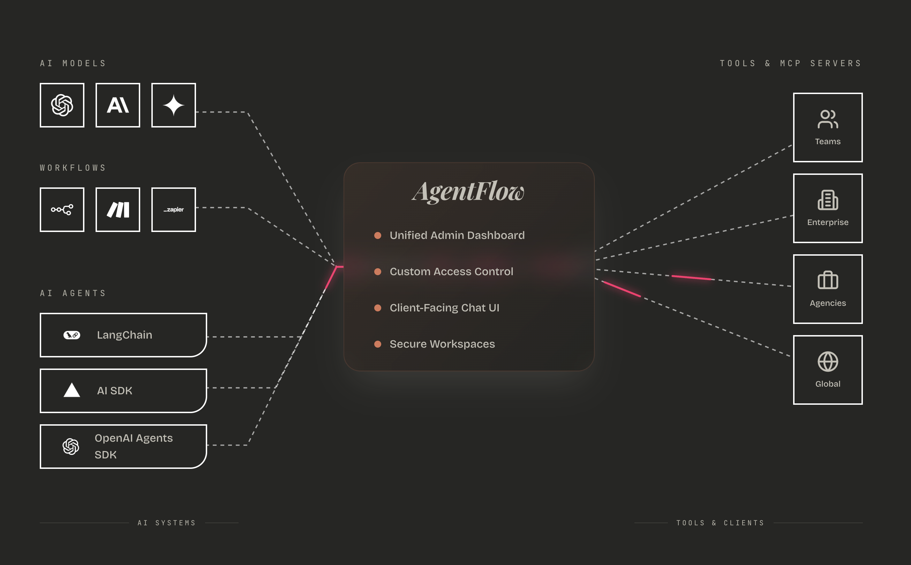
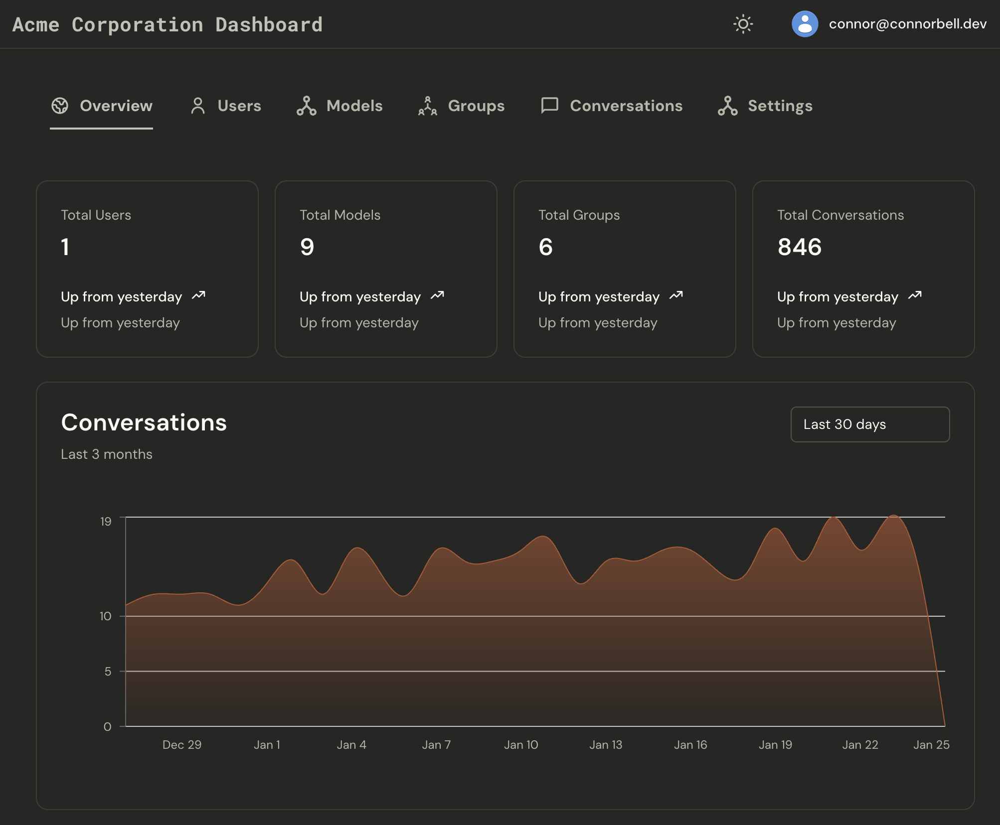

# AgentFlow

### Enterprise AI Connection and Distribution Platform

**Connect your AI endpoints, workflows, or agent builders, then distribute them across organizations with built-in access control and data isolation.**

[](LICENSE)
[](https://nextjs.org/)
[](https://www.typescriptlang.org/)

[☁️ Fully Hosted Platform](https://app.agentflow.live) · [🏠 Website](https://agentflow.live) · [🚀 Self-Host Guide](#-quick-start) · [📖 Documentation](#-documentation) · [💬 Discussions](https://github.com/your-org/chat-platform/discussions) · [🐛 Issues](https://github.com/your-org/chat-platform/issues)

<p align="center">
  
</p>

---

> **💡 New to AgentFlow?**
>
> **[Start with our fully hosted platform →](https://app.agentflow.live)** No installation needed. Free tier available.
>
> Prefer self-hosting? [Jump to installation guide](#option-2-self-hosted-open-source)

---

## Why AgentFlow?

**The Problem:** You've built powerful AI agents, but sharing them means building chat UIs, authentication, multi-tenant infrastructure, and access control. That's 3-6 months of development before your first user.

**The Solution:** AgentFlow provides enterprise-ready infrastructure for AI distribution. Connect your HTTP endpoint with a YAML file and instantly get:

- ✅ Production-ready chat interface
- ✅ Organization-based multi-tenancy
- ✅ Group-based access control
- ✅ Complete conversation history
- ✅ Secure credential handling

**Perfect for:** AI engineers distributing agents to clients, SaaS companies offering tiered AI features, agencies providing AI solutions, and internal teams building department-specific tools.

→ [Read: Why Choose AgentFlow](./docs/WHY_AGENTFLOW.md)

---

## 🚀 Quick Start

### Option 1: Fully Hosted Platform (Recommended)

**Don't want to manage infrastructure? We've got you covered.**

**[Get Started on AgentFlow Cloud →](https://app.agentflow.live)**

✅ **Zero setup** - Sign up and start in 2 minutes
✅ **Fully managed** - We handle hosting, updates, and maintenance
✅ **Production-ready** - Enterprise-grade infrastructure
✅ **Free tier available** - No credit card required to start

Perfect for teams who want to focus on AI, not DevOps.

---

### Option 2: Self-Hosted (Open Source)

**Prerequisites:**

- Node.js 18+
- Supabase CLI ([Installation](https://supabase.com/docs/guides/cli))
- PostgreSQL database (local or cloud)

**5-Minute Setup:**

```bash
# Clone and install
git clone https://github.com/your-org/chat-platform.git
cd chat-platform
npm install

# Configure environment
cp .env.example .env.local
# Edit .env.local with your Supabase and database credentials

# Start database
supabase start
supabase db reset

# Run application
npm run dev
```

**Visit:** http://localhost:3000

→ [Complete Installation Guide](./docs/getting-started/INSTALLATION.md)

---

## 🎯 What You Can Do

### Connect Any AI Endpoint

```yaml
# Simple YAML configuration
name: 'GPT-4'
endpoint: 'https://api.openai.com/v1/chat/completions'
headers:
  Authorization: 'Bearer {{api_key}}'
request_schema:
  model: 'gpt-4'
  messages:
    - role: 'user'
      content: '{{message}}'
response_path: 'choices[0].message.content'
```

**Works with:**

- Direct APIs (OpenAI, Anthropic, etc.)
- Workflows (n8n, Make.com, Zapier)
- Custom agents (LangChain, CrewAI, AutoGen)
- Cloud functions (Cloud Run, Lambda, etc.)

→ [See Example Configurations](./examples/)

### Control Access with Groups

```
Organization: Your Company
├── Group: "Engineering Team" → GPT-4, Code Assistant
├── Group: "Marketing Team" → GPT-3.5, Content Writer
└── Group: "Executive Team" → Claude Opus, All Models

Users automatically get access based on group membership.
```

→ [Access Control Guide](./docs/guides/ACCESS_CONTROL.md)

### Multi-Tenant Data Isolation

```
Platform Deployment
├── Client A (Organization) → Their AI models, their data
├── Client B (Organization) → Their AI models, their data
└── Client C (Organization) → Their AI models, their data

Complete separation. Row-Level Security enforced at database level.
```

→ [Multi-Tenant Guide](./docs/guides/MULTI_TENANT.md)

---

## 📊 Admin Dashboard

Track usage, manage users, and monitor conversations across your organization.

<p align="center">
  
</p>

---

## 📋 Example Use Cases

**For AI Consultants**
Build custom agents for 5 clients → Deploy AgentFlow once → Create 5 organizations → Connect each client's endpoint → Complete data isolation

**For SaaS Companies**
Free tier → GPT-3.5 | Pro tier → GPT-4 | Enterprise → Custom model
Automatic access based on subscription group

**For Agencies**
Legal team → Legal AI | HR team → HR AI | Sales team → Sales AI
One platform, department-specific access

**For Agent Builders**
Build LangChain agent → Deploy to Cloud Run → Connect to AgentFlow → Professional chat interface without building UI

→ [See All Use Cases](./docs/USE_CASES.md)

---

## ⚡ Features

### ✅ Implemented

- 🔌 **AI Connections:** Connect any HTTP endpoint with YAML config
- 👥 **Multi-Tenant:** Complete organization-based data isolation
- 🔐 **Access Control:** Group-based permissions with Owner/Admin/Guest roles
- 💬 **Chat Interface:** Responsive UI with message history and search
- 📊 **Conversation Management:** History, export, feedback collection
- 🔒 **Security:** Row-Level Security, encrypted API keys, audit trails

### 🔜 Coming Soon

- 📈 **Analytics:** Token usage tracking, cost analysis, usage dashboards
- 📎 **Multimedia:** File uploads, voice input/output, image analysis
- 👥 **Collaboration:** Conversation sharing, team mentions, real-time collab
- 🚀 **Advanced:** Conversation branching, mobile apps, custom export formats

→ [Complete Feature List](./docs/FEATURES.md)

---

## 📖 Documentation

### Getting Started

| Guide                                                        | Time   | Description                |
| ------------------------------------------------------------ | ------ | -------------------------- |
| [Installation](./docs/getting-started/INSTALLATION.md)       | 30 min | Complete setup walkthrough |
| [Supabase Auth Setup](./docs/SUPABASE_AUTH_SETUP.md)         | 15 min | Configure authentication   |
| [First Endpoint](./docs/getting-started/FIRST_ENDPOINT.md)   | 15 min | Connect your first AI      |
| [Troubleshooting](./docs/getting-started/TROUBLESHOOTING.md) | -      | Common issues and fixes    |

### Guides

| Guide                                                         | Description                      |
| ------------------------------------------------------------- | -------------------------------- |
| [YAML Configuration](./docs/guides/YAML_CONFIG.md)            | Complete configuration reference |
| [Access Control](./docs/guides/ACCESS_CONTROL.md)             | Groups, roles, permissions       |
| [Endpoint Integration](./docs/guides/ENDPOINT_INTEGRATION.md) | Build compatible endpoints       |
| [Multi-Tenant Setup](./docs/guides/MULTI_TENANT.md)           | Organization architecture        |

### Examples

| Platform         | Configuration                                                           |
| ---------------- | ----------------------------------------------------------------------- |
| OpenAI GPT       | [openai-gpt-config.yaml](./examples/openai-gpt-config.yaml)             |
| Anthropic Claude | [anthropic-claude-config.yaml](./examples/anthropic-claude-config.yaml) |
| n8n Workflows    | [n8n-workflow-config.yaml](./examples/n8n-workflow-config.yaml)         |
| LangChain Agents | [langchain-agent-config.yaml](./examples/langchain-agent-config.yaml)   |
| Make.com         | [make-workflow-config.yaml](./examples/make-workflow-config.yaml)       |

→ [All Examples with Setup Instructions](./examples/)

### Additional Documentation

- [Why AgentFlow](./docs/WHY_AGENTFLOW.md) - Problem/solution overview
- [Use Cases](./docs/USE_CASES.md) - Real-world scenarios
- [Features](./docs/FEATURES.md) - Complete feature list
- [Architecture](./docs/ARCHITECTURE.md) - System architecture
- [Security](./docs/SECURITY.md) - Security policies
- [Deployment](./docs/DEPLOYMENT.md) - Production deployment
- [Contributing](./CONTRIBUTING.md) - Contribution guide

---

## 🛠️ Tech Stack

**Frontend**

- Next.js 14 (App Router)
- React 18 (Server Components)
- TypeScript
- Tailwind CSS
- Radix UI

**Backend**

- PostgreSQL (via Supabase)
- Supabase Auth (Authentication)
- Row-Level Security (RLS)
- Server Actions

**Infrastructure**

- Supabase (Database & Auth)
- Vercel (Recommended hosting)
- Docker (Local development)

---

## 🚢 Deployment

### Fully Managed Cloud Hosting

**Production-ready infrastructure without the hassle:**

☁️ **[AgentFlow Cloud](https://app.agentflow.live)** - Fully hosted and managed

- ✅ **Zero DevOps** - We manage servers, scaling, and updates
- ✅ **Enterprise SLA** - 99.9% uptime guarantee
- ✅ **Automatic backups** - Your data is always safe
- ✅ **24/7 monitoring** - We keep your AI agents running
- ✅ **Free tier** - Start free, scale as you grow
- ✅ **Enterprise plans** - Custom solutions for large teams

**This is the same codebase, fully managed by the AgentFlow team.**

→ [View Pricing & Plans](https://agentflow.live/pricing)

---

### Self-Hosted Deployment (Full Control)

**Vercel (Recommended)**

```bash
# 1. Push to GitHub
git push origin main

# 2. Import to Vercel
# Visit vercel.com → Import project

# 3. Add environment variables
# Vercel Dashboard → Settings → Environment Variables

# 4. Deploy
# Automatic on git push
```

**Other Platforms**

```bash
# 1. Build application
npm run build

# 2. Set environment variables

# 3. Run production server
npm run start
```

→ [Complete Deployment Guide](./docs/DEPLOYMENT.md)

---

## 🤝 Contributing

We welcome contributions! AgentFlow is open source (AGPL-3.0).

**Before contributing:**

- ⚠️ All contributors must sign our [Contributor License Agreement (CLA)](CLA.md)
- Our bot will guide you through this on your first PR

**How to contribute:**

1. Fork the repository
2. Create feature branch (`git checkout -b feature/amazing-feature`)
3. Commit changes (`git commit -m 'Add amazing feature'`)
4. Push to branch (`git push origin feature/amazing-feature`)
5. Open Pull Request
6. Sign CLA when prompted (first-time only)

→ [Contributing Guide](./CONTRIBUTING.md)

---

## 📞 Support & Community

- 🌐 **[Website](https://agentflow.live)** - Learn more about AgentFlow
- ☁️ **[Fully Hosted Platform](https://app.agentflow.live)** - Managed cloud hosting (no setup required)
- 💬 **[GitHub Discussions](https://github.com/your-org/chat-platform/discussions)** - Ask questions, share ideas
- 🐛 **[GitHub Issues](https://github.com/your-org/chat-platform/issues)** - Report bugs
- 📖 **[Documentation](./docs/)** - Comprehensive guides
- 📧 **Email:** support@agentflow.live

---

## 📄 License

This project is licensed under the **GNU Affero General Public License v3.0 (AGPL-3.0)**.

**This means:**

- ✅ You can use, modify, and distribute this software
- ✅ You can use it commercially
- ⚠️ If you modify and distribute it, you must share your source code under AGPL
- ⚠️ If you run a modified version as a web service, you must provide source code to users

See the [LICENSE](./LICENSE) file for full details.

---

## 🙏 Acknowledgments

Built with:

- [Next.js](https://nextjs.org/) - React framework
- [Better-Auth](https://www.better-auth.com/) - Authentication
- [Supabase](https://supabase.com/) - Database & backend
- [Tailwind CSS](https://tailwindcss.com/) - Styling
- [Radix UI](https://www.radix-ui.com/) - UI components

---

## 🗺️ Roadmap

**Current Focus:**

- Analytics and usage tracking
- Multimedia support (files, voice, images)
- Mobile applications

**Upcoming:**

- Advanced collaboration features
- Enterprise SSO/SAML
- Custom branding/white-label

→ See [Complete Roadmap](./docs/PRODUCT_ROADMAP.md) (coming soon)

---

## ⭐ Star History

If you find AgentFlow useful, please star the repository! It helps others discover the project.

---

**Status:** Beta - Core features are stable, advanced features in active development.

**Last Updated:** January 2025

---

<div align="center">

**Stop building infrastructure. Start shipping AI.**

**Choose your path:**

[☁️ Fully Managed Cloud](https://app.agentflow.live) · [🔧 Self-Host (Open Source)](./docs/getting-started/INSTALLATION.md) · [📖 Learn More](https://agentflow.live)

</div>
